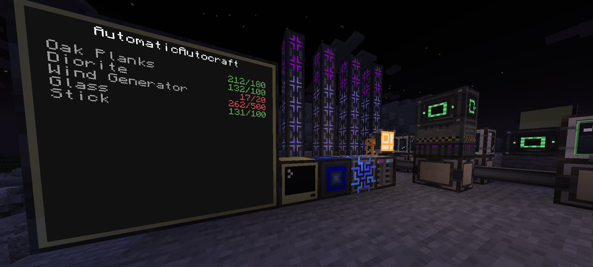
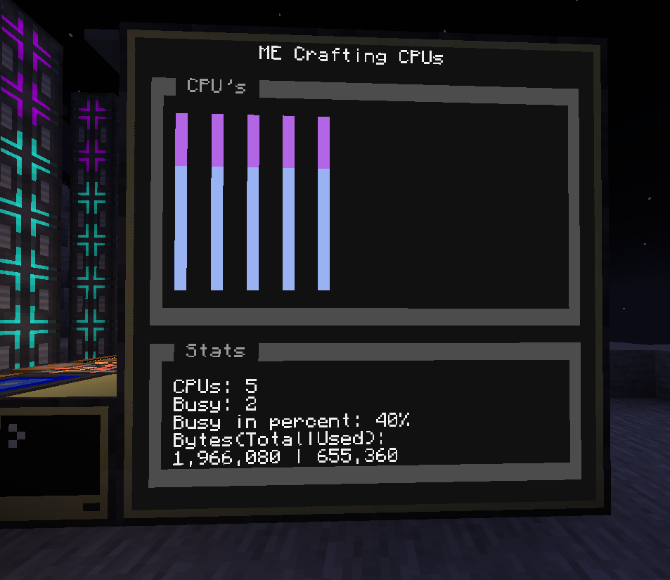

# ME Bridge

!!! picture inline end
    { align=right }

The ME Bridge is able to interact with Applied Energistics 2.
You can retrieve items, craft items, get all items as a list and more. The ME Bridge uses one channel.

!!! warning "Requirement"
    Requires the [Applied Energistics 2](https://www.curseforge.com/minecraft/mc-mods/applied-energistics-2) mod to be installed

<p class="picture-spacing" style="--ps:0.6rem;"></p>

---

<div class="center-table" markdown>

| Peripheral Name | Interfaces with | Has events | Introduced in |
| --------------- | --------------- | ---------- | ------------- |
| meBridge        | ME System       | Yes        | 0.3b          |

</div>

---

!!! failure
    <center> <h3> You need to place the inventory/tank you want to use to export/import stuff next to the ME Bridge and **NOT** next to the computer! <h3> </center>

## Events

### crafting
Fires when a crafting job starts or fails.  
**Values:**  
1. `success: boolean` Indicates whether a crafting job has successfully started or not  
2. `message: string` A message about the status of the crafting job  
These values are equivalent to the return values of [`craftItem()`](#craftitem).

```lua linenums="1"
local event, success, message = os.pullEvent("crafting")
if success then
    print("A crafting job has successfully started")
else
    print("A crafting job has failed to start")
end
```

## Functions

The RS and ME Bridge now share the same functionality. Check [this Guide](../guides/storage_system_functions) for the whole documentation for every available feature.

## Examples

### Automatic Autocrafting

This script automatically crafts items in a list.
Do you want 500 glass in your me system at all times? Add glass to the list and the script will craft it for you.
No need for level emitters or crafting cards!

You can find instructions on how to install the script [here](https://github.com/SirEndii/Lua-Projects/tree/master)



### ME Crafting CPUs

This script shows you some statistics about the ME crafting cpus.

You can find instructions on how to install the script [here](https://github.com/SirEndii/Lua-Projects/tree/master)



---

## Changelog/Trivia

**0.7r**  
The ME Bridge does uses computercraft relative and cardinal directions.
We also changed some function names.

**0.4b**  
Reworked the system of the ME Bridge, it now has more features and a new system for the `item` parameter.

**0.3.9b**  
Added the `importItem` and `exportItem` from container functions.

**0.3b**  
Added the ME Bridge with a good amount of features.
